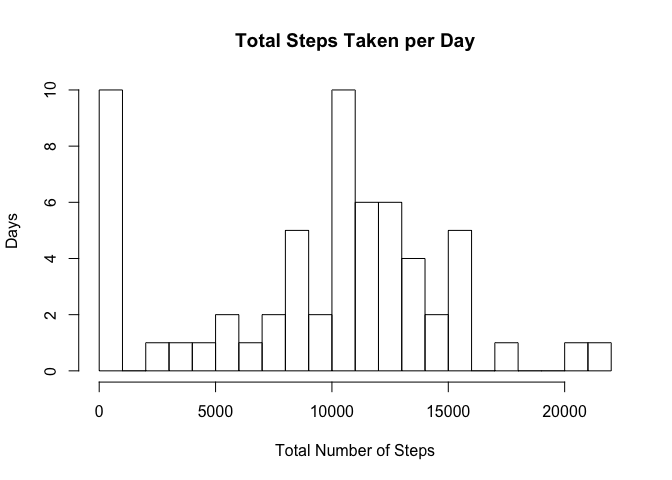
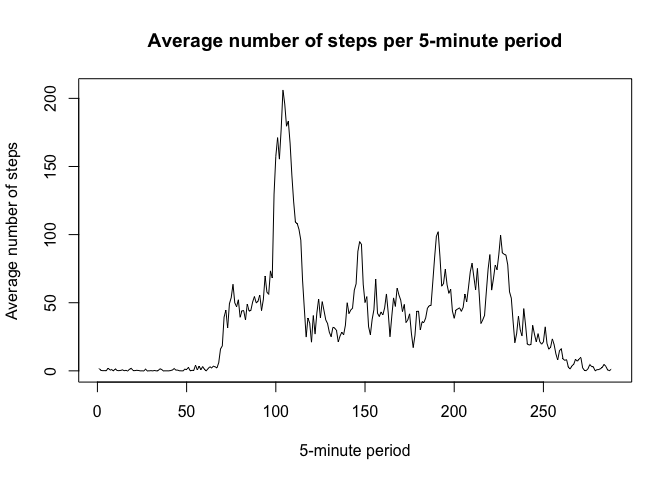
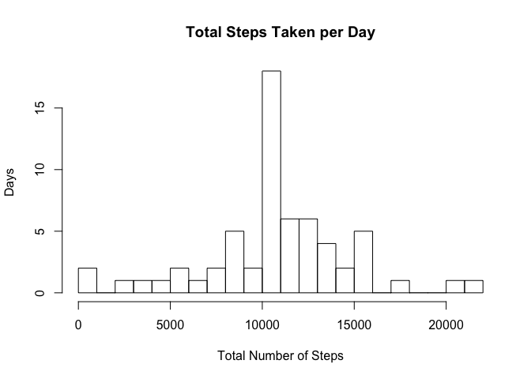
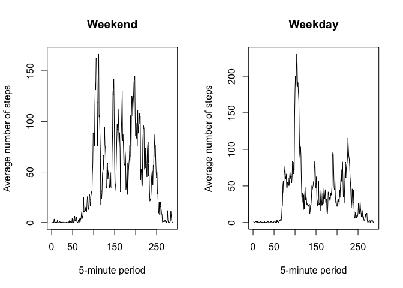

# Reproducible Research Course Project 1
Brian Lackey  


##Loading and pre-processing data


```r
table <- read.csv("activity.csv")
summary(table)
```

```
##      steps                date          interval     
##  Min.   :  0.00   2012-10-01:  288   Min.   :   0.0  
##  1st Qu.:  0.00   2012-10-02:  288   1st Qu.: 588.8  
##  Median :  0.00   2012-10-03:  288   Median :1177.5  
##  Mean   : 37.38   2012-10-04:  288   Mean   :1177.5  
##  3rd Qu.: 12.00   2012-10-05:  288   3rd Qu.:1766.2  
##  Max.   :806.00   2012-10-06:  288   Max.   :2355.0  
##  NA's   :2304     (Other)   :15840
```

##Mean total number of steps per day

```r
table2<-aggregate(table$steps,list(date=table$date),FUN="sum", na.rm=TRUE)

hist(table2$x,breaks=25, main="Total Steps Taken per Day", xlab="Total Number of Steps", ylab="Days")
```

<!-- -->

```r
mean(table2$x)
```

```
## [1] 9354.23
```

```r
median(table2$x)
```

```
## [1] 10395
```
##Average daily activity pattern

```r
table3<-aggregate(table$steps,list(interval=table$interval),FUN="mean", na.rm=TRUE)

plot(table3$x,type="l", main="Average number of steps per 5-minute period", ylab="Average number of steps", xlab="5-minute period")
```

<!-- -->

```r
table3[table3$x==max(table3$x),"interval"]
```

```
## [1] 835
```
##Imputing missing values

```r
sum(is.na(table$steps))
```

```
## [1] 2304
```

```r
#Replacing all NAs with the average for that interval
avgs<-aggregate(table$steps,list(interval=table$interval),FUN="mean",na.rm=TRUE)

table4<-merge(table,avgs,by="interval")
table4$steps<-ifelse(is.na(table4$steps),table4$x,table4$steps)

table5<-aggregate(table4$steps,list(date=table4$date),FUN="sum", na.rm=TRUE)

hist(table5$x,breaks=25, main="Total Steps Taken per Day", xlab="Total Number of Steps", ylab="Days")
```

<!-- -->

```r
mean(table5$x)
```

```
## [1] 10766.19
```

```r
median(table5$x)
```

```
## [1] 10766.19
```
##Weekdays vs Weekends

```r
table4$day<-weekdays(as.Date(table4$date))

table4$weekvsweekend<-ifelse(table4$day %in% c("Monday", "Tuesday", "Wednesday", "Thursday", "Friday"),"Weekday","Weekend")

table6<-aggregate(table4$steps,list(interval=table4$interval, weekvsweekend=table4$weekvsweekend),FUN="mean", na.rm=TRUE)

par(mfrow=c(1,2))

plot(table6$x[table6$weekvsweekend=="Weekend"],type="l",main="Weekend",ylab="Average number of steps",xlab="5-minute period",col=1)

plot(table6$x[table6$weekvsweekend=="Weekday"],type="l",main="Weekday",ylab="Average number of steps",xlab="5-minute period",col=1)
```

<!-- -->
